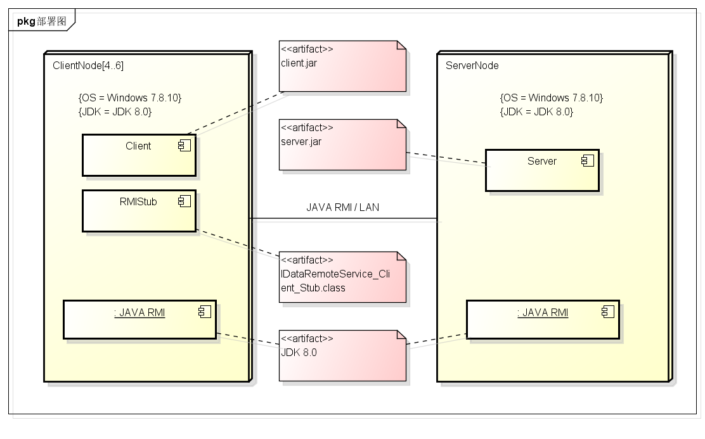

# 进销存系统软件体系结构描述文档

### V1.0正式版

##### 南京大学软件学院16级软工二小分队（19组）

2017-10-16

---

## 1 引言

### 1.1 编制目的

* 本报告详细完成对进销存系统的概要设计，达到知道详细设计和开发的目的，同时实现和测试人员及用户的沟通。
* 本报告面向开发人员、测试人员以及最终用户而编写，是了解系统的导航。

### 1.2 词汇表

* ​CSheet：check sheet，报表查看
* EADocum：Examine and Approve Document，审批单据
* SetStrate：Set Strategy，指定销售策略
* GManagerFrame：General Manager，总经理
* ​
* 
* 

### 1.3 参考资料

* 《进销存系统用例文档V2.0》
* 《进销存系统需求规格说明文档V1.0》
* 《软件开发的技术基础》

## 2 产品概述

* 参考进销存系统用例文档和进销存系统软件需求规格说明中对产品的概括描述。

## 3 逻辑视角

* 进销存系统中，选择了分层体系结构风格，系统分为3层（展示层、业务逻辑层、数据层）能够很好地示意整个高层抽象。展示层包括GUI页面的实现，业务逻辑层包含业务逻辑处理的实现，数据层负责数据的持久化和访问。分层体系结构的逻辑视角和逻辑设计方案如图3-1和图3-2所示。

**图3-1  logic view**

**图3-2  软件体系结构逻辑设计方案**

## 4 组合视角

### 4.1 开发包图

**表1  进销存系统最终开发包设计**

|开发（物理）包 |依赖的其他开发包 |  
|:---|:---|  
|mainui |userui,adminui,imanagerui,salemsmanui,financerui,gmanagerui,vo|
|userui|userblservice,vo|
|adminui|adminblservice,vo|
|imanagerui|imanageui,iinforui,idocumui,vo|
|salesmanui|importui,salesui,clientui,vo|
|financerui|logui,accountui,setupui,receiptui,csheetui,vo|
|gmanagerui|logui,csheetui,eadocumui,setstrateui,vo|
|iinforui|imanageblservice,vo|
|imanageui|imanageblservice,vo|
|idocumui|idocumblservice,vo|
|importui|importblservice,vo|
|salesui|salesblservice,vo|
|clientui|clientblservice,vo|
|logui|logblservice,vo|
|accountui|accountblservice,vo|
|setupui|setupblservice,vo|
|receiptui|receiptblservice,vo|
|csheetui|csheetblservice,vo|
|eadocumui|eadocumblservice,vo|
|setstrateui|setstrateblservice,vo|
|userblservice||
|adminblservice||
|imanageblservice||
|idocumblservice||
|importblservice||
|salesblservice||
|clientblservice||
|logblservice||
|accountblservice||
|setupblservice||
|receiptblservice||
|csheetblservice||
|eadocumblservice||
|setstrateblservice||
|userbl|userblservice,userdataservice,logbl|
|adminbl|adminblservice,userbl,logbl|
|imanagebl|imanageblservice,logbl,inventorydataservice|
|idocumbl|idocumblservice,idocumdataservice,imanagebl,logbl|
|importbl|imanagebl,logbl,importdataservice,importblservice,idocumbl|
|salesbl|salesblservice,imanagebl,importbl,salesdataservice,logbl,setstratebl|
|clientbl|logbl,clientdataservice,clientblservice|
|accountbl|logbl,accountdataservice,accountblservice|
|setupbl|clientbl,accountbl,logbl,setupdataservice,setupblservice|
|receiptbl|logbl,receiptdataservice,receiptblservice|
|csheetbl|csheetblservice,salesbl,importbl,idocumbl,logbl,receiptbl|
|eadocumbl|salesbl,importbl,idocumbl,logbl,receiptbl,eadocumblservice|
|setstratebl|setstrateblservice,logbl,setstratedataservice|
|userdataservice|JAVA RMI,po|
|inventorydataservice|JAVA RMI,po|
|idocumdataservice|JAVA RMI,po|
|importdataservice|JAVA RMI,po|
|salesdataservice|JAVA RMI,po|
|clientdataservice|JAVA RMI,po|
|logdataservice|JAVA RMI,po|
|accountdataservice|JAVA RMI,po|
|setupdataservice|JAVA RMI,po|
|receiptdataservice|JAVA RMI,po|
|setstratedataservice|JAVA RMI,po|
|po||
|vo||
|JAVA RMI||
|userdata|userdataservice,databaseutility|
|inventorydata|databaseutility,inventorydataservice|
|idocumdata|databaseutility,idocumdataservice|
|importdata|importdataservice,databaseutility|
|salesdata|databaseutility,salesdataservice|
|clientdata|databaseutility,clientdataservice|
|logdata|databaseutility,logdataservice|
|accountdata|databaseutility,accountdataservice|
|setupdata|databaseutility,setupdataservice|
|receiptdata|databaseutility,receiptdataservice|
|setstratedata|databaseutility,setstratedataservice|
|databaseutility||

**图4.1-1  进销存系统客户端开发包图**

**图4.1-2  进销存系统服务器端开发包图**

### 4.2 运行时进程

* 在进销存系统中，会有多个客户端进程和一个服务器端进程，其进程图如图4.2-1所示。结合部署图，客户端进程是在客户端机器上运行，服务器端进程在服务器端机器上运行。

**图4.2-1  进程图**

### 4.3 物理部署

* 进销存系统中客户端构件是放在服务器端机器上。在客户端节点上，还要部署RMIStub构件。由于Java RMI构件属于JDK 6.0的一部分。所以，在系统JDK环境已经设置好的情况下，不需要再独立部署。部署图如图4.3-1所示。

**图4.3-1  部署图**

## 5 接口视角

### 5.1 模块的职责

* 客户端模块和服务器端模块视图分别如图7和图8所示。客户端各层和服务器端各层的职责分别如表5.1-1和表5.1-2所示。

**图5.1-1  客户端模块视图**

**图5.1-2  服务端模块视图**

  ​
**表5.1-1  客户端各层的职责**

| 层       | 职责                     |  
| :------ | :--------------------- |  
| 启动模块    | 负责初始化网络通信机制，启动用户界面     |  
| 用户界面层   | 基于窗口的进销存系统客户端界面        |  
| 业务逻辑层   | 对于用户界面的输入进行相应并进行业务处理逻辑 |  
| 客户端网络模块 | 利用Java RMI机制查找RMI服务    |  

​**表5.1-2  服务器端各层的职责**

| 层        | 职责                          |  
| :------- | :-------------------------- |  
| 启动模块     | 负责初始化网络通信机制，启动用户界面    |  
| 数据层      | 负责数据的持久化及数据访问接口             |  
| 服务器端网络模块 | 利用Java RMI机制开启RMI服务，注册RMI服务 |  

* 每一层只是使用下方直接接触的层。层与层之间仅仅是通过接口的调用来完成的。层之间调用的接口如表5.1-3所示。 

**表5.1-3   层之间调用的接口**

| 接口   | 服务调用方    | 服务提供方    |
| :------- | :------- | :--- |
|     | 客户端展示层   | 客户端业务逻辑层 |  
|     | 客户端业务逻辑层 | 服务器端数据层  |  

* 借用销售用例来说明层之间的调用，如图5.1-3所示。每一层之间都是由上层依赖了一个接口（需接口），而下层实现这个接口（供接口）。SalesBLService提供了Sales界面所需要的所有业务逻辑功能。SalesDataService提供了对数据库的增、删、改、查等操作。这样的实现就大大降低了层与层之间的耦合。   

**图5.1-3 销售用例层之间调用的接口**

### 5.2 用户界面层的分解

* 根据需求，系统存在38个用户界面：登录界面、管理员界面、库存管理人员界面、进货销售人员界面、财务人员界面、总经理界面、调整用户界面、单据种类选择界面、销售退货单界面、销售单界面、进货单界面、进或退货单界面、客户管理界面、库存商品管理界面、分析库存界面、库存报单选择界面、库存报警单界面、库存赠送单界面、库存报溢单界面、库存报损单界面、库存盘点界面、库存查询界面、查看日志界面、查看报表种类选择界面、销售明细表界面、经营历程表界面、经营情况表界面、期初建账界面、管理银行账户界面、款单种类选择界面、收款单界面、付款单／现金费用单界面、审批单据界面、促销策略种类选择界面、赠品策略界面、价格折让策略界面、赠品策略界面、代金券赠送界面、价格包策略界面。

**图5.2-1 用户界面跳转**

* 服务器端和客户端的用户界面设计接口是一致的，只是具体的页面不一样。用户界面类如图5.2-2所示。

**图5.2-2 用户界面类**

#### 5.2.1 用户界面层模块的职责

* 用户界面模块的职责如表5.2-1所示。

**表5.2-1  用户界面层模块的职责**

| 模块        | 职责                    |
| :-------- | :-------------------- |
| MainFrame | 界面Frame，负责界面的显示和界面的跳转 |
| UserFrame | 用户Frame，负责界面的显示和界面的跳转 |
| AdminFrame | 管理员Frame，负责界面的显示和界面的跳转 |
| IManageFrame | 库存管理人员Frame，负责界面的显示和界面的跳转 |
| SalesmanFrame | 进货销售人员Frame，负责界面的显示和界面的跳转 |
| ImportFrame | 进货/进货退货Frame，负责界面的显示和界面的跳转 |
| SalesFrame | 销售/销售退货Frame，负责界面的显示和界面的跳转 |
| ClientFrame | 客户管理Frame，负责界面的显示和界面的跳转 |
| FinancerFrame | 财务人员Frame，负责界面的显示和界面的跳转 |
| LogFrame | 日志查看Frame，负责界面的显示和界面的跳转 |
| AccountFrame | 管理银行账户Frame，负责界面的显示和界面的跳转 |
| SetupFrame | 期初建账Frame，负责界面的显示和界面的跳转 |
| ReceiptFrame | 制定款单Frame，负责界面的显示和界面的跳转 |
| GManagerFrame | 总经理Frame，负责界面的显示和界面的跳转 |
| CSheetFrame | 查看报表Frame，负责界面的显示和界面的跳转 |
| EADocumFrame | 审批单据Frame，负责界面的显示和界面的跳转 |
| SetStrateFrame | 制定销售策略Frame，负责界面的显示和界面的跳转 |

#### 5.2.2 用户界面层模块的接口规范

* 用户界面层模块的接口规范如表5.2.2-1所示。

**表5.2.2-1  用户界面层模块的接口规范**

| 提供的服务（供接口） | | |
|:--|:--|:--|
| MainFrame | 语法 | init() |
| | 前置条件 | 启动程序 |
| | 后置条件 | 显示 UserFrame 以及 LoginPanel |
| UserFrame | 语法 | init() |
| | 前置条件 | 显示MainFrame |
| | 后置条件 | 登录成功后显示 登录人员对应的功能界面。 |
| AdminFrame | 语法 | init() |
| | 前置条件 | 管理员在UserFrame成功登录 |
| | 后置条件 | 显示 管理员功能按钮（管理员工信息，退出登录） |
| IManagerFrame | 语法 | init() |
| | 前置条件 | 库存管理人员在UserFrame成功登录 |
| | 后置条件 | 显示 库存管理人员功能按钮（管理库存商品，库存分析，库存报单，退出登录） |
| IManageFrame | 语法 | init() |
| | 前置条件 | 库存管理人员在IManagerFrame选择 管理库存商品 |
| | 后置条件 | 显示库存商品列表 |
| IInforFrame | 语法 | init() |
| | 前置条件 | 库存管理人员在IManagerFrame选择 库存分析 |
| | 后置条件 | 显示库存查询和库存盘点按钮 |
| IDocumFrame | 语法 | init() |
| | 前置条件 | 库存管理人员在IManagerFrame选择 库存报单 |
| | 后置条件 | 显示 库存类单据 列表 |
| SalesmanFrame | 语法 | init() |
| | 前置条件 | 进货销售人员在UserFrame成功登录 |
| | 后置条件 | 显示 进货销售人员功能按钮（进货/进货退货款单制定，销售/销售退货款单制定，客户管理，退出登录） |
| ImportFrame | 语法 | init() |
| | 前置条件 | 进货销售人员在SalesmanFrame选择 进货/进货退货款单制定 |
| | 后置条件 | 显示 进货/进货退货款单 列表 |
| SalesFrame | 语法 | init() |
| | 前置条件 | 进货销售人员在SalesmanFrame选择 销售/销售退货款单制定 |
| | 后置条件 | 显示 销售/销售退货款单 列表 |
| ClientFrame | 语法 | init() |
| | 前置条件 | 进货销售人员在SalesmanFrame选择 客户管理 |
| | 后置条件 | 显示 客户 列表 |
| FinancerFrame | 语法 | init() |
| | 前置条件 | 财务人员在UserFrame成功登录 |
| | 后置条件 | 显示 财务人员功能按钮（查看日志，管理银行账户，期初建账，制定款单，查看报表，退出登录） |
| LogFrame | 语法 | init() |
| | 前置条件 | 财务人员或总经理在FinancerFrame选择 查看日志 |
| | 后置条件 | 显示 日志 列表 |
| AccountFrame | 语法 | init() |
| | 前置条件 | 财务人员在FinancerFrame选择 管理银行账户 |
| | 后置条件 | 显示 银行账户 列表 |
| SetupFrame | 语法 | init() |
| | 前置条件 | 财务人员在FinancerFrame选择 期初建账 |
| | 后置条件 | 显示 账单 列表 |
| ReceiptFrame | 语法 | init() |
| | 前置条件 | 财务人员在FinancerFrame选择 制定款单  |
| | 后置条件 | 显示 付款单/收款单/现金费用单 列表|
| GManagerFrame | 语法 | init() |
| | 前置条件 | 总经理在UserFrame成功登录 |
| | 后置条件 | 显示 总经理功能按钮（查看报表，审批单据，制定销售策略，查看日志，退出登录） |
| CSheetFrame | 语法 | init() |
| | 前置条件 | 总经理在GManagerFrame选择 查看报表 |
| | 后置条件 | 显示 报表选择按钮（销售明细表，经营历程表，经营情况表） |
| EADocumFrame | 语法 | init() |
| | 前置条件 | 总经理在GManagerFrame选择 审批单据 |
| | 后置条件 | 显示 未审核单据 列表 |
| SetStrateFrame | 语法 | init() |
| | 前置条件 | 总经理在GManagerFrame选择 制定销售策略 |
| | 后置条件 | 显示 销售策略选择按钮（赠品策略，价格折让策略，代金券赠送策略，特价包策略） |

* 用户界面层需要的服务接口如表5.2.2-2所示。

**表5.2.2-2  用户界面层模块需要的服务接口**

* 每个界面都有一个相应的业务逻辑接口

| 服务名 | 服务 |
| :--- | :---  |
| BusinessLogicservice.userblservice | 登录界面 业务逻辑接口，含有登录业务接口 |
| BusinessLogicService.adminblservice | 管理员界面对应 业务逻辑接口 |
| BusinessLogicService.imanageblservice | 管理库存商品，库存分析对应 业务逻辑接口 |
| BusinessLogicService.idocumblservice | 库存类单据对应 业务逻辑接口 |
| BusinessLogicService.importblservice | 进货/进货退货 业务逻辑接口 |
| BusinessLogicService.salesblservice | 销售/销售退货 业务逻辑接口 |
| BusinessLogicService.clientblservice | 客户管理 业务逻辑接口 |
| BusinessLogicService.logblservice | 日志查看 业务逻辑接口 |
| BusinessLogicService.accountblservice | 管理银行账户 业务逻辑接口 |
| BusinessLogicService.setupblservice | 期初建账 业务逻辑接口 |
| BusinessLogicService.receiptblservice | 制定款单 业务逻辑接口 |
| BusinessLogicService.csheetblservice | 查看报表 业务逻辑接口 |
| BusinessLogicService.eadocumblservice | 审批单据 业务逻辑接口 |
| BusinessLogicService.setstrateblservice | 制定销售策略 业务逻辑接口 |

#### 5.2.3 用户界面模块设计原理

* 用户界面利用Java FX来实现。

### 5.3 业务逻辑层的分解

* 业务逻辑层包括多个针对界面的业务逻辑处理对象。
* 业务逻辑的设计如图5.3-1所示。

#### 5.3.1 业务逻辑层模块的职责

* 业务逻辑层模块的职责如表5.3.1-1所示。

**表5.3.1-1  业务逻辑层模块的职责**

| 模块 | 职责 |
| :--- | :---  |
| userbl | 负责实现登录界面和登录 所需要的服务 |
| adminbl | 负责实现管理员界面对应 所需要的服务 |
| imanagebl | 负责实现管理库存商品，库存分析对应 所需要的服务 |
| idocumbl | 负责实现库存类单据对应 所需要的服务 |
| importbl | 负责实现进货/进货退货 所需要的服务 |
| salesbl | 负责实现销售/销售退货 所需要的服务 |
| clientbl | 负责实现客户管理 所需要的服务 |
| logbl | 负责实现日志查看 所需要的服务 |
| accountbl | 负责实现管理银行账户 所需要的服务 |
| setupbl | 负责实现期初建账 所需要的服务 |
| receiptbl | 负责实现制定款单 所需要的服务 |
| csheetbl | 负责实现查看报表 所需要的服务 |
| eadocumbl | 负责实现审批单据 所需要的服务 |
| setstratebl | 负责实现制定销售策略 所需要的服务 |

#### 5.3.2 业务逻辑层模块的接口规范

* 模块的接口规范

**表5.3.2-1 业务逻辑层模块的接口规范**

|||提供的服务（供接口）|
|:---|:---|:---|
|Logbl.view|语法|public ResultMessage view(String data);|
||前置条件|输入data符合输入规则且合法|
||后置条件|查找是否有对应时间内的data,根据data返回对应的查找内容|
|Logbl.write|语法|public void write(String message);|
||前置条件|已完成单步操作并确认|
||后置条件|将message操作信息写入记录中|
|||需要的服务（需接口）|
|服务名||服务|
|LogDataService|

### 5.4 数据层的分解

* 数据层主要给业务逻辑层提供数据访问服务，包括对于持久化数据的增、删、改、查。（**要补充**）由于持久化的数据的保存可能存在多种形式：（**待讨论**）数据层模块的描述具体如图5.4-1所示。

**图5.4-1 数据层模块的描述**

#### 5.4.1 数据层模块的职责  
* 数据层模块的职责如表11所示。

**表7  数据层模块的职责**    

|模块|职责|
| :--- | :--- |
| UserDataService | 持久化数据库的接口，提供集体载入、集体保存、增、删、改、查服务 |
| UserDataServiceTxtFileImpl | 基于Txt文件的持久化数据库的接口，提供集体载入、集体保存、增、删、改、查服务 |
| UserDataSerializableFileImpl | 基于序列化文件的持久化数据库的接口，提供集体载入、集体保存、增、删、改、查服务 |
| UserDataServiceMySqlImpl | 基于MySql数据库的持久化数据库的接口，提供集体载入、集体保存、增、删、改、查服务 |
| ClientDataService | 持久化数据库的接口，提供集体载入、集体保存、增、删、改、查服务 |
| ClientDataServiceTxtFileImpl | 基于Txt文件的持久化数据库的接口，提供集体载入、集体保存、增、删、改、查服务 |
| ClientDataSerializableFileImpl | 基于序列化文件的持久化数据库的接口，提供集体载入、集体保存、增、删、改、查服务 |
| ClientDataServiceMySqlImpl | 基于MySql数据库的持久化数据库的接口，提供集体载入、集体保存、增、删、改、查服务 |
| SalesDataService | 持久化数据库的接口，提供集体载入、集体保存、增、删、改、查服务 |
| SalesDataServiceTxtFileImpl | 基于Txt文件的持久化数据库的接口，提供集体载入、集体保存、增、删、改、查服务 |
| SalesDataSerializableFileImpl | 基于序列化文件的持久化数据库的接口，提供集体载入、集体保存、增、删、改、查服务 |
| SalesDataServiceMySqlImpl | 基于MySql数据库的持久化数据库的接口，提供集体载入、集体保存、增、删、改、查服务 |
| ImportDataService | 持久化数据库的接口，提供集体载入、集体保存、增、删、改、查服务 |
| ImportDataServiceTxtFileImpl | 基于Txt文件的持久化数据库的接口，提供集体载入、集体保存、增、删、改、查服务 |
| ImportDataSerializableFileImpl | 基于序列化文件的持久化数据库的接口，提供集体载入、集体保存、增、删、改、查服务 |
| ImportDataServiceMySqlImpl | 基于MySql数据库的持久化数据库的接口，提供集体载入、集体保存、增、删、改、查服务 |
| IDocumDataService | 持久化数据库的接口，提供集体载入、集体保存、增、删、改、查服务 |
| IDocumDataServiceTxtFileImpl | 基于Txt文件的持久化数据库的接口，提供集体载入、集体保存、增、删、改、查服务 |
| IDocumDataSerializableFileImpl | 基于序列化文件的持久化数据库的接口，提供集体载入、集体保存、增、删、改、查服务 |
| IDocumDataServiceMySqlImpl | 基于MySql数据库的持久化数据库的接口，提供集体载入、集体保存、增、删、改、查服务 |
| InventoryDataService | 持久化数据库的接口，提供集体载入、集体保存、增、删、改、查服务 |
| InventoryDataServiceTxtFileImpl | 基于Txt文件的持久化数据库的接口，提供集体载入、集体保存、增、删、改、查服务 |
| InventoryDataSerializableFileImpl | 基于序列化文件的持久化数据库的接口，提供集体载入、集体保存、增、删、改、查服务 |
| InventoryDataServiceMySqlImpl | 基于MySql数据库的持久化数据库的接口，提供集体载入、集体保存、增、删、改、查服务 |

#### 5.4.2 数据层模块的接口规范    

* 数据层模块的接口规范如表5.4.2-1所示。   

**表5.4.2-1 数据层模块的接口规范**    

**表12 数据层模块的接口规范**    
  
|||提供的服务（供接口）|
| :--- | :--- | :--- |
||语法|public ClientPO find(long id) throws RemoteException|
|ClientDataService.find|前置条件|无|
||后置条件|按ID进行查找返回相应的ClientPO结果|
||语法|public void insert(ClientPO po) throws RemoteException|
|ClientDataService.insert|前置条件|无|
||后置条件|按ID进行查找返回相应的ClientPO结果|
||语法|public void delete(ClientPO po) throws RemoteException|
|ClientDataService.delete|前置条件|无|
||后置条件|按ID进行查找返回相应的ClientPO结果|
||语法|public void update(ClientPO po) throws RemoteException|
|ClientDataService.update|前置条件|无|
||后置条件|按ID进行查找返回相应的ClientPO结果|
||语法|public void init() throws RemoteException|
|ClientDataService.init|前置条件|无|
||后置条件|按ID进行查找返回相应的ClientPO结果|
||语法|public void finish() throws RemoteException|
|ClientDataService.finish|前置条件|无|
||后置条件|按ID进行查找返回相应的ClientPO结果|
||语法|public SalesPO find(long id) throws RemoteException|
|SalesDataService.find|前置条件|无|
||后置条件|按ID进行查找返回相应的ClientPO结果|
||语法|public void insert(SalesPO po) throws RemoteException|
|SalesDataService.insert|前置条件|无|
||后置条件|按ID进行查找返回相应的ClientPO结果|
||语法|public void delete(SalesPO po) throws RemoteException|
|SalesDataService.delete|前置条件|无|
||后置条件|按ID进行查找返回相应的ClientPO结果|
||语法|public void update(SalesPO po) throws RemoteException|
|SalesDataService.update|前置条件|无|
||后置条件|按ID进行查找返回相应的SalesPO结果|
||语法|public void init() throws RemoteException|
|SalesDataService.init|前置条件|无|
||后置条件|按ID进行查找返回相应的SalesPO结果|
||语法|public void finish() throws RemoteException|
|SalesDataService.finish|前置条件|无|
||后置条件|按ID进行查找返回相应的SalesPO结果|
||语法|public ClientPO find(long id) throws RemoteException|
|UserDataService.find|前置条件|无|
||后置条件|按ID进行查找返回相应的UserPO结果|
||语法|public void insert(UserPO po) throws RemoteException|
|UserDataService.insert|前置条件|无|
||后置条件|按ID进行查找返回相应的UserPO结果|
||语法|public void delete(UserPO po) throws RemoteException|
|UserDataService.delete|前置条件|无|
||后置条件|按ID进行查找返回相应的UserPO结果|
||语法|public void update(UserPO po) throws RemoteException|
|UserDataService.update|前置条件|无|
||后置条件|按ID进行查找返回相应的UserPO结果|
||语法|public void init() throws RemoteException|
|UserDataService.init|前置条件|无|
||后置条件|按ID进行查找返回相应的UserPO结果|
||语法|public void finish() throws RemoteException|
|UserDataService.finish|前置条件|无|
||后置条件|按ID进行查找返回相应的UserPO结果|
||语法|public ClientPO find(long id) throws RemoteException|
|ImportDataService.find|前置条件|无|
||后置条件|按ID进行查找返回相应的ImportPO结果|
||语法|public void insert(ImportPO po) throws RemoteException|
|ImportDataService.insert|前置条件|无|
||后置条件|按ID进行查找返回相应的ImportPO结果|
||语法|public void delete(ImportPO po) throws RemoteException|
|ImportDataService.delete|前置条件|无|
||后置条件|按ID进行查找返回相应的ClientPO结果|
||语法|public void update(ImportPO po) throws RemoteException|
|ImportDataService.update|前置条件|无|
||后置条件|按ID进行查找返回相应的ImportPO结果|
||语法|public void init() throws RemoteException|
|ImportDataService.init|前置条件|无|
||后置条件|按ID进行查找返回相应的ImportPO结果|
||语法|public void finish() throws RemoteException|
|ImporttDataService.finish|前置条件|无|
||后置条件|按ID进行查找返回相应的ClientPO结果|
||语法|public ClientPO find(long id) throws RemoteException|
|InventoryDataService.find|前置条件|无|
||后置条件|按ID进行查找返回相应的ClientPO结果|
||语法|public void insert(InventoryPO po) throws RemoteException|
|InventoryDataService.insert|前置条件|无|
||后置条件|按ID进行查找返回相应的ClientPO结果|
||语法|public void delete(InventoryPO po) throws RemoteException|
|InventoryDataService.delete|前置条件|无|
||后置条件|按ID进行查找返回相应的InventoryPO结果|
||语法|public void update(InventoryPO po) throws RemoteException|
|InventoryDataService.update|前置条件|无|
||后置条件|按ID进行查找返回相应的InventoryPO结果|
||语法|public void init() throws RemoteException|
|InventoryDataService.init|前置条件|无|
||后置条件|按ID进行查找返回相应的InventoryPO结果|
||语法|public void finish() throws RemoteException|
|InventoryDataService.finish|前置条件|无|
||后置条件|按ID进行查找返回相应的InventoryPO结果|
||语法|public ClientPO find(long id) throws RemoteException|
|IDocumDataService.find|前置条件|无|
||后置条件|按ID进行查找返回相应的IDocumPO结果|
||语法|public void insert(IDocumPO po) throws RemoteException|
|IDocumDataService.insert|前置条件|无|
||后置条件|按ID进行查找返回相应的IDocumPO结果|
||语法|public void delete(IDocumPO po) throws RemoteException|
|IDocumDataService.delete|前置条件|无|
||后置条件|按ID进行查找返回相应的IDocumPO结果|
||语法|public void update(IDocumPO po) throws RemoteException|
|IDocumDataService.update|前置条件|无|
||后置条件|按ID进行查找返回相应的IDocumPO结果|
||语法|public void init() throws RemoteException|
|IDocumDataService.init|前置条件|无|
||后置条件|按ID进行查找返回相应的IDocumPO结果|
||语法|public void finish() throws RemoteException|
|IDocumDataService.finish|前置条件|无|
||后置条件|按ID进行查找返回相应的IDocumPO结果|

## 6 信息视角

### 6.1 数据持久化对象  
系统的PO类就是对应的相关的实体类，在此只做简单的介绍。    
* UserPO类包含用户的用户名、职位、密码属性。  
* ClientPO类包含客户的编号、分类、级别、姓名、电话、地址、邮编、电子邮箱、应收额度、应收、应付、默认业务员。  
* SalesPO类包含销售/销售退货单的单据编号，客户，业务员，操作员，仓库，出（回）货商品清单（包括商品的编号，名称，型号，数量，单价，金额，商品备注。），折让前总额，折让，使用代金卷金额，折让后总额，备注。  
* ImportPO类包含进货/进货退货单的单据编号，供应商，仓库，操作员，入/出库商品列表（包括商品编号，名称，型号，数量，单价，金额，备注），备注，总额合计。  
* InventoryPO类包含商品的分类、编号、名称、型号、库存数量、进价、零售价、最近进价、最近零售价。  
* IDocumPO类包含

### 6.2 Txt持久化格式

### 6.3 数据库表